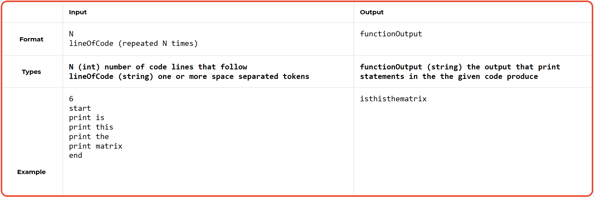
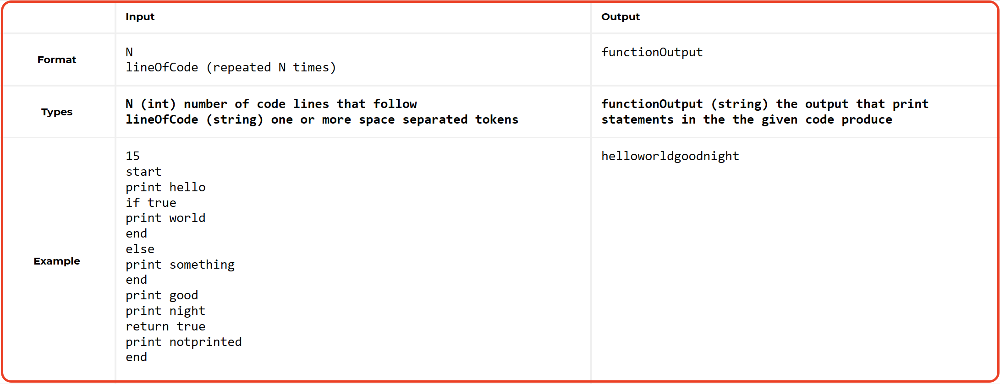

# Compiler-Breakout
In this Challenge, you are stuck in a computer simulation and will need to interpret some instructions in order to find your way out. So, I have written a compiler that can parse code in a new programming language with similar features to existing languages but also some new ones.

### Level 1:

### Level 2:

For More information, go through the attached PDF files along with the corresponding level folder.

## Built With

- HTML
- CSS
- JavaScipt
- Webpack
- ES6

## Live Demo

[Live View!!](https://vagyasri.github.io/Compiler-Breakout/dist/)

## Author

👤 **Bhagyashree Patra**

- GitHub: [@Vagyasri](https://github.com/Vagyasri)
- Twitter: [@Vagyasri](https://twitter.com/Vagyasri)
- LinkedIn: [Bhagyashree Patra](https://www.linkedin.com/in/bhagyashree-patra-029bb059/)

## Getting Started

### Prerequisites:

- Web browser
- Code Editor (VS Code)
- Live Server Extension

### Cloning the repo to your local system (If you already have git, installed in your system):

- [Copy this link](https://github.com/Vagyasri/Compiler-Breakout.git)
- Open your terminal or command line
- Run "git clone [Paste this link](https://github.com/Vagyasri/Compiler-Breakout.git)"
- Open the folder with your code editor
- Now You can edit the code and check the changes in the browser using Live Server

### Webpack Setup:

- Initialize `npm`: Run `npm init -y`
- Install `webpack` and  `webpack-cli` locally: Run `npm install webpack webpack-cli --save-dev`

### Implement the changes and Get Live View in Localhost:

- Run: `npm run build`
- Run: `npm start`

### Install Jest using NPM:
- Run: `npm install --save-dev jest`

### For Running Jest:
- Run: `npm run test or npm test`

### Check linter errors:

- Install npm
- For HTML: Run npx hint .
- For CSS: Run npx stylelint "**/*.{css,scss}"
- For JS: Run npx eslint .

## 🤝 Contributing

Contributions, issues, and feature requests are welcome!

Start by:

- Forking the project
- Cloning the project to your local machine
- cd into the Youtube-Replica project directory
- Run git checkout -b your-branch-name
- Make your contributions
- Push your branch up to your forked repository
- Open a Pull Request with a detailed description to the development branch of the original project for a review

Feel free to check the [issues page](https://github.com/Vagyasri/Compiler-Breakout/issues), contribute to the Project by creating an issue.

## Show your support
Give a ⭐️ if you like this project!
